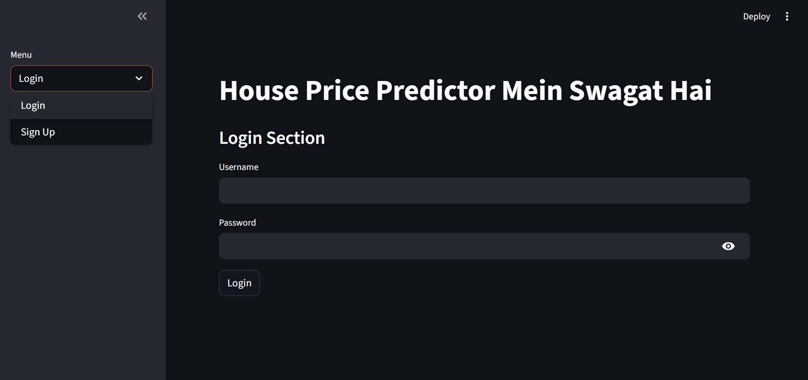
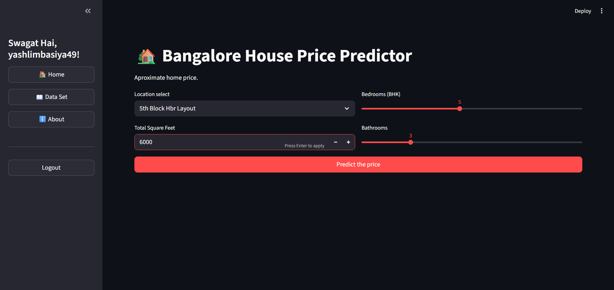
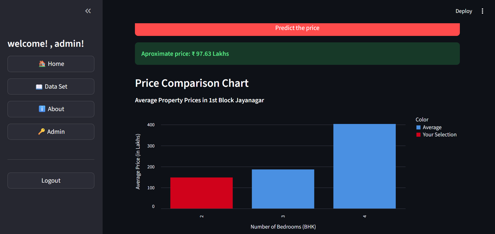
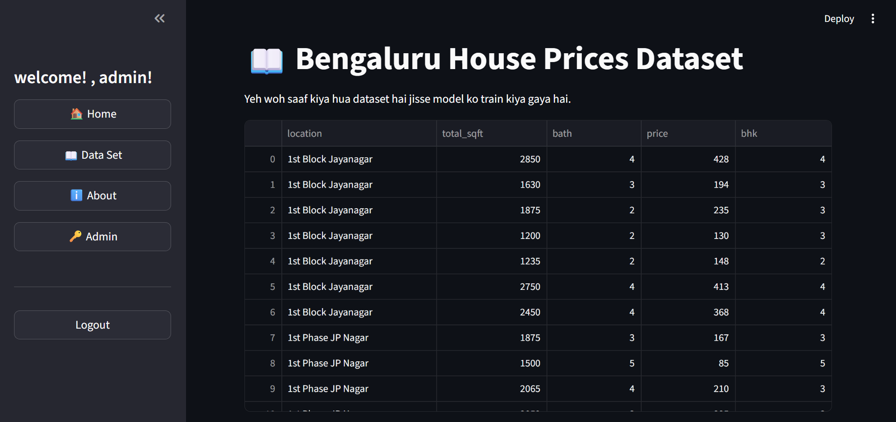
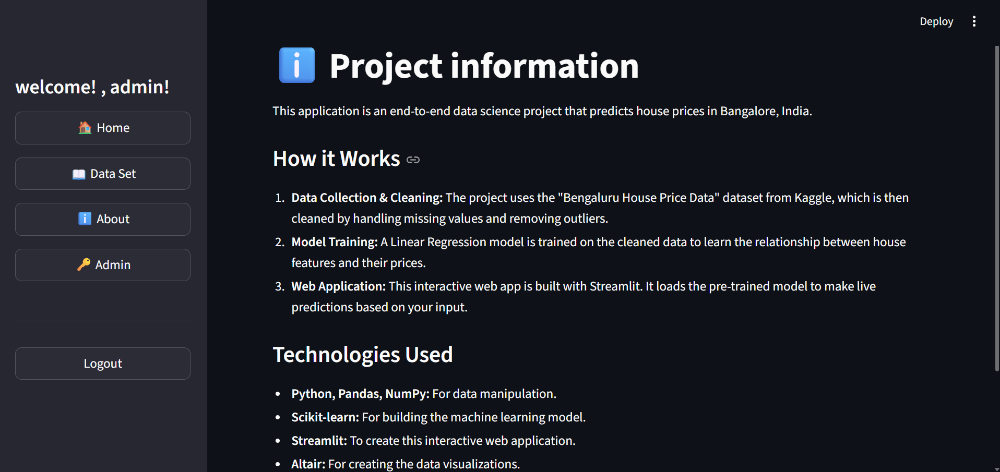

<a id="readme-top"></a>

# Bangalore House Price Prediction 🏡


## Overview

This is an end-to-end data science project that predicts house prices in Bangalore, India. It uses a **Linear Regression** model trained on real-world data from the `bengaluru_house_prices (1).csv` dataset.

The project is deployed as an interactive web application using **Streamlit**. It's not just a simple predictor; it also includes a complete **user authentication** system (Login & Sign Up) using a SQLite database, as well as a special **admin panel** to view registered users.

<br>

## 🚀 Application Preview

Here is a walkthrough of the application's features:

## 🚀 Application Preview

Here is a walkthrough of the application's features:

### 1. Secure Login
The app features a secure login and sign-up system to manage user access.
<p align="center">
  
</p>

### 2. Home Page & Price Prediction
The main home page is where users can input property details. It features sliders and dropdowns for location, square feet, BHK, and bathrooms.
<p align_content="center">
  
</p>
<p align="center">
  
</p>

### 3. Prediction Result & Comparison Chart
After clicking "Predict," the app shows the estimated price and a dynamic bar chart. This chart compares your selection's price to the average prices for other property sizes in that same location.
<p align="center">
  
</p>

### 4. Interactive Dataset
A "Data Set" page allows users to view and explore the final, cleaned dataset that was used to train the machine learning model.
<p align="center">
  
</p>

### 5. Project Information
An "About" page details the project's workflow, from data collection to deployment, and lists the technologies used.
<p align="center">
  
</p>
<br>

## ✨ Key Features

* **📈 Real-time Price Prediction:** Get instant price estimates (in Lakhs) based on location, square feet, bathrooms, and BHK.
* **👤 User Authentication:** A secure Login and Sign Up system built from scratch (using `data.py` and `SQLite`).
* **🔑 Admin Panel:** A special admin login (`admin`/`admin123`) to view a list of all registered users in the database.
* **📊 Data Exploration:** An interactive "Dataset" page to view the final `cleaned_house_data.csv` used for training.

<br>

## 🛠️ Tech Stack: Libraries, Skills & Methods

This project combines skills from data science, machine learning, and web application development.

### Programming & Libraries

* **`Python`**: The core language for the entire project.
* **`Streamlit`**: Used to build and serve the interactive, multi-page web application (`app.py`).
* **`Scikit-learn`**: The main library for machine learning. Used for `LinearRegression`, `GridSearchCV`, and `train_test_split`.
* **`Pandas`**: Used for all data loading, cleaning, and manipulation (`bengaluru_house_prices (1).csv` -> `cleaned_house_data.csv`).
* **`NumPy`**: Used for numerical operations and data transformations.
* **`SQLite`**: The database used to store user information (`user_data.db`) via the helper functions in `data.py`.
* **`Jupyter Notebook`**: Used for all data science experimentation, from cleaning to modeling (`house_price.ipynb`).
* **`Pickle`**: Used to save the trained machine learning model (`banglore_home_prices_model.pickle`).
* **`JSON`**: Used to save the list of data columns (`columns.json`).

### Data Science & ML Methods

* **Data Cleaning:** Handled messy real-world data, such as converting `size` (e.g., "2 BHK") into a numeric `bhk` column and averaging `total_sqft` values given as a range (e.g., "1000 - 1500").
* **Outlier Removal:** Applied domain knowledge (e.g., price-per-square-foot, bathrooms-to-BHK ratio) to identify and remove extreme outliers.
* **Feature Engineering:** Used **One-Hot Encoding** to convert the categorical `location` column into numerical features for the model.
* **Model Selection:** Used `GridSearchCV` to test and compare different regression models, ultimately selecting `LinearRegression` as the best performer.
* **Model Persistence:** Saved the final trained model (`.pickle`) and column list (`.json`) so the Streamlit app can load and use them for predictions.

<br>

## 🏁 How to Run

To run this project on your local machine, follow these steps:

1.  **Clone the repository:**
    ```bash
    git clone [https://github.com/yashlimbasiya444/AI-Driven-House-Price-Estimator.git](https://github.com/yashlimbasiya444/AI-Driven-House-Price-Estimator.git)
    ```

2.  **Navigate to the project directory:**
    ```bash
    cd AI-Driven-House-Price-Estimator
    ```

3.  **Install the required libraries:**
    ```bash
    pip install streamlit pandas numpy scikit-learn altair
    ```

4.  **Run the Streamlit application:**
    ```bash
    streamlit run app.py
    ```

5.  Open your web browser and go to the local URL (usually `http://localhost:8501`).

## 🤝 Contributing

Contributions are welcome! If you have ideas for improvements or find any bugs, feel free to open an issue or fork the repository and submit a pull request.

<br>

## 📬 Get in Touch!

Feel free to reach out for collaborations or questions:

* [](https://github.com/yashlimbasiya444) 💻 - Explore more projects by Yash Limbasiya.
* [](https://www.linkedin.com/in/yash-limbasiya-177268359) 🌠- Let's connect professionally.
